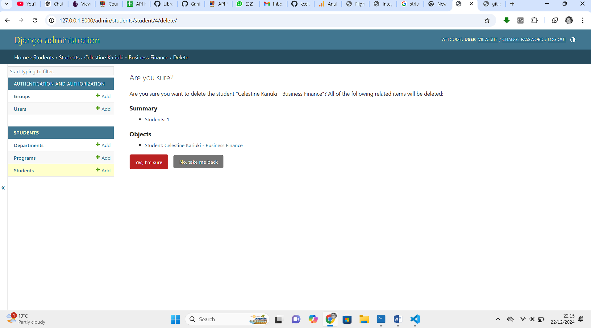

# Student Enrollment System API Documentation

Welcome to the **Student Enrollment System API** documentation! This guide provides comprehensive information about the API, its endpoints, and instructions to set up and test the project locally.

This API System is meant as group assignment for the course BBIT, unit API, at Strathmore University.
Here are the names of the students in the group assignment, who contributed:
1. Celestine Kariuki - Student No. 116533
2. Eghosa Edokpolo - Student No. 170492
3. Mohammed Mumin - Student No. 165700
4. Wayne Opanja - Student No. 166937
5. Amina Abigail - Student No. 100485
6. Mumo Mwangangi - Student No. 165437

---

## Table of Contents

1. [Overview](#overview)
2. [Installation](#installation)
3. [Environment Setup](#environment-setup)
4. [API Endpoints](#api-endpoints)
    - [Schools](#schools)
    - [Students](#students)
    - [Courses](#courses)
    - [Academic Years](#academic-years)
    - [Semesters](#semesters)
    - [Enrollments](#enrollments)
5. [Testing with Postman](#testing-with-postman)
6. [Contributing](#contributing)

---

## Overview

The **Student Enrollment System API** is built using Django and Django REST Framework (DRF). It enables managing schools, students, courses, academic years, semesters, and enrollments. The API features user authentication and role-based access for secure interaction.

---

## Design Decisions

Here's a revised version of the response, presented in a more human and conversational tone:

---

## Design Decisions

When building the **Student Enrollment System API**, I aimed for a clean, scalable design that reflects the real-world relationships between students, courses, and institutions. The database design leverages Django’s ORM capabilities while ensuring the structure is easy to extend and maintain. Here's an overview of the key decisions and the relationships between models:


### 1. Database Selection
I chose **SQLite** as the database for this project during development. It's lightweight, requires no additional setup, and integrates perfectly with Django. For production, migrating to PostgreSQL or MySQL would be a logical step for better performance and scalability.


### 2. Models and Their Relationships

The API’s models were designed to mirror the core components of an academic system, with each model representing a distinct entity. Here's how they connect:

#### **a. School**
- The `School` model is at the top of the hierarchy, representing educational institutions.
- It includes fields like `school_name` and metadata (`created_at`, `created_by`).
- **Relationships**: The `created_by` field links to Django’s built-in `User` model, which tracks who added the school. This helps in auditability.


#### **b. Department**
- Departments organize courses and programs. Each department has its own unique `department_code` and `department_name`, along with the `head_of_department`.
- **Relationships**: While the model doesn’t directly link to `School`, its connection is implied through other models like `Course` and `Program`.

#### **c. Program**
- Academic programs belong to specific departments and represent a course of study like "Computer Science" or "Business Administration."
- **Relationships**: The `department` field links `Program` to `Department`, creating a parent-child relationship.

#### **d. Course**
- The `Course` model captures all the academic courses available. Each course has its own `course_code`, `course_name`, description, and credit value.
- **Relationships**: Courses are tied to a department via a ForeignKey. This association ensures each course belongs to a specific area of study.

#### **e. Student**
- Students are central to the system, represented with fields like `first_name`, `last_name`, `email`, and `phone_number`. There’s also validation for phone numbers to ensure proper formatting.
- **Relationships**: Students can enroll in a `Program`, which is optional (e.g., undeclared majors). The `program` field links students to their respective academic programs.

#### **f. Enrollment**
- This is a bridge model tracking which students are enrolled in which courses. It also stores the `grade` and `enrollment_date`.
- **Relationships**: ForeignKeys connect `Student` and `Course`, forming a many-to-many relationship between these two models.

#### **g. Instructor**
- Instructors are represented with fields for personal information like `first_name`, `last_name`, and `email`.
- **Relationships**: Instructors are linked to a department, specifying where they belong within the academic structure.

#### **h. ClassSession**
- This model tracks individual sessions for a course, including start and end times and the location of the class.
- **Relationships**: Each session is tied to a `Course` and optionally to an `Instructor`, reflecting the real-world setup of classes.

#### **i. Attendance**
- Attendance records track whether a student was present or absent for a class session.
- **Relationships**: Links to both `ClassSession` and `Student` ensure that each record specifies who attended which session.

### 3. Guiding Principles Behind the Design

- **Normalization**: The database design avoids redundancy by breaking entities into smaller, logical components. For instance, `Course` is separate from `Program` to allow reuse across multiple programs.
- **Validation and Constraints**: Unique fields like `email` and `course_code` prevent duplicate entries. Phone numbers are validated using regex to maintain consistency.
- **Auditability**: Models like `School` include metadata fields like `created_at` and `created_by` for tracking changes and accountability.
- **Graceful Deletion**: ForeignKey options such as `on_delete=models.SET_NULL` ensure the system handles deletions without breaking data integrity.
- **Future-Proofing**: The model structure is flexible, making it easy to introduce features like grading systems, course prerequisites, or library management without significant rewrites.

This design keeps the system organized, maintainable, and easy to extend as the project grows. It’s a balance between simplicity for the current scope and adaptability for future needs.

---

## Installation

Follow these steps to clone and run the project locally:

### Prerequisites
Ensure the following are installed on your system:
- Python 3.8+
- pip (Python package manager)
- Git

### Clone the Repository

```bash
$ git clone https://github.com/your-repository/enrollment-system.git
$ cd enrollment-system
```

---

## Environment Setup

### 1. Create a Virtual Environment

```bash
$ python -m venv venv
$ source venv/bin/activate  # On Windows, use venv\Scripts\activate
```

### 2. Install Dependencies

```bash
$ pip install -r requirements.txt
```

### 3. Apply Migrations

```bash
$ python manage.py migrate
```

### 4. Create a Superuser

```bash
$ python manage.py createsuperuser
```

### 5. Run the Server

```bash
$ python manage.py runserver
```

The application will be available at `http://127.0.0.1:8000/`.

---

## API Endpoints

### Authentication(Currently Disabled)

- You can go to Admin on this URL `POST /admin/`
 

### Schools
- **List/Create Schools**
  - `GET /api/schools/`
  - `POST /api/schools/`

- **Retrieve/Update a School**
  - `GET /api/schools/{id}/`
  - `PUT /api/schools/{id}/`

### Students
- **List/Create Students**
  - `GET /api/students/`
  - `POST /api/students/`

- **Retrieve/Update a Student**
  - `GET /api/students/{id}/`
  - `PUT /api/students/{id}/`

### Courses
- **List/Create Courses**
  - `GET /api/courses/`
  - `POST /api/courses/`

- **Retrieve/Update a Course**
  - `GET /api/courses/{id}/`
  - `PUT /api/courses/{id}/`

### Academic Years
- **List/Create Academic Years**
  - `GET /api/academicyears/`
  - `POST /api/academicyears/`

- **Retrieve/Update an Academic Year**
  - `GET /api/academicyears/{id}/`
  - `PUT /api/academicyears/{id}/`

### Semesters
- **List/Create Semesters**
  - `GET /api/semesters/`
  - `POST /api/semesters/`

- **Retrieve/Update a Semester**
  - `GET /api/semesters/{id}/`
  - `PUT /api/semesters/{id}/`

### Enrollments
- **List/Create Enrollments**
  - `GET /api/enrollments/`
  - `POST /api/enrollments/`

- **Retrieve/Update an Enrollment**
  - `GET /api/enrollments/{id}/`
  - `PUT /api/enrollments/{id}/`

---

## Testing with Postman(Included With Screenshots)
*(We used Postman Visual Studio Code Extension, as the desktop agent is buggy and heavy!)


Figure 1: Postman As a VS Code Extension


Figure 2: Postman In Action Part 1

### Step 3: Test Endpoints


Figure 3: Postman In Action Part 2


Figure 4: Get A Student By his/her ID


Figure 5: Get All Students

#### Example: Create a School
1. Select the `POST /api/schools/` endpoint.
2. In the body, input:
   ```json
   {
     "school_name": "Strathmore University"
   }
   ```
3. Send the request.
4. Successful Response:
   ```json
   {
     "id": 1,
     "school_name": "Strathmore University",
     "created_at": "2024-12-19T12:00:00Z",
     "created_by": 1
   }
   ```

Figure 6: Update A Student's Details using a PUT Request


Figure 7: Delete A Student By his/her ID


Figure 8: Get All Student's Details After running the DELETE HTTP Action Method


## Admin Functionality
Also, here is the Admin, as we enter a Student's Data, with in-built validation:


Figure 9: Enter Student Data, System Validates


Here is another image showing us having added data for all entities successfully:


Figure 10: Enter All Enrollment System Data


We can even delete a record, see:


Figure 11: Delete Student Data on Admin

## Successful Unit Testing
We also successfully ran Python Unit Tests:


Figure 12: Successful Unit Testing Data

## Contributing

We welcome contributions to enhance the functionality of the API. Please follow these steps:
1. Fork the repository.
2. Create a feature branch.
3. Commit your changes and open a pull request.

---

Thank you for using the **Student Enrollment System API**! If you encounter any issues, please open an issue in the repository.

